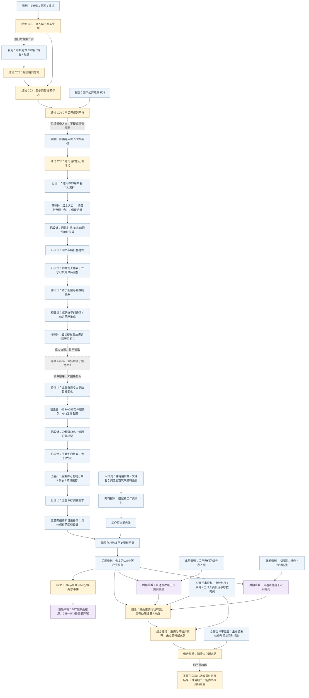
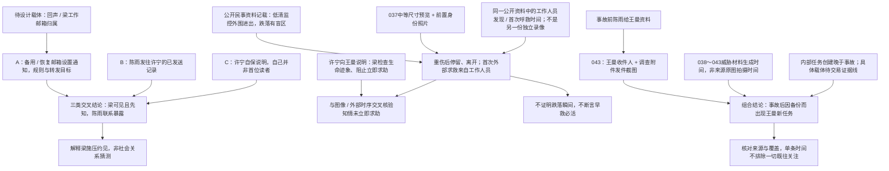
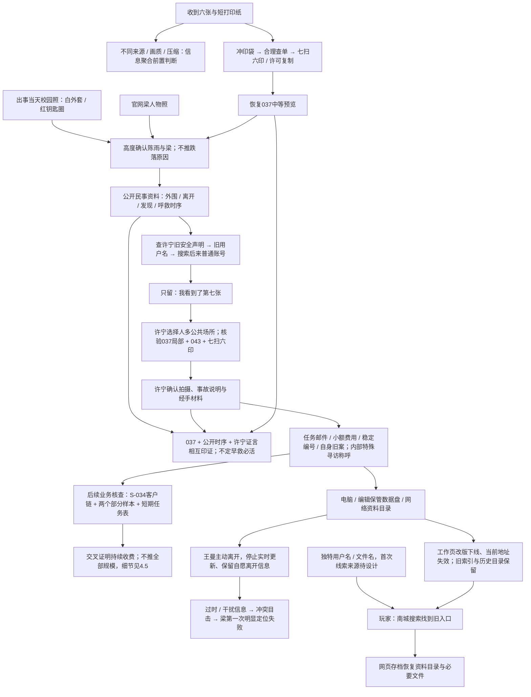
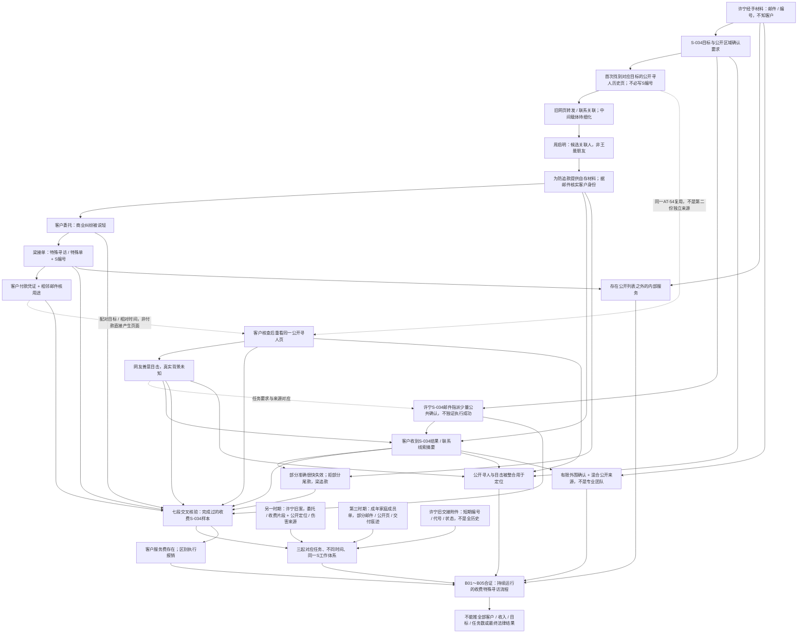

# 《寻人启事》信息依赖设计图

> 开发设计资料，玩家不可见。唯一剧情事实来源仍为 [story-bible.md](story-bible.md)。本文将已确定事实映射到信息出现、复用和证明依赖；不创建页面、素材、游戏事实 ID、解锁条件或谜题代码。

## 1. 范围与标记

- A～D 对应现有 phase-01，已有 `F01`～`F10`、`C01`～`C05`、`R01`～`R05` 的含义不变。具体访问方式见 [phase-01-reachability.md](phase-01-reachability.md)。
- E～P为已确定canon的后续信息设计，**尚未实现**。“已设计”表示来源 / 路径锁定，不代表代码已完成。王曼过程见 [wang-man-investigation.md](wang-man-investigation.md)，业务流程与三个样本见 [special-search-business.md](special-search-business.md)，载体见 [evidence-artifacts.md](evidence-artifacts.md)。
- `A-01` 等 ID 只用于本文追踪信息依赖，不是新增 Case evidence / relation / puzzle ID。
- “玩家首次理解”描述当时证据允许得出的最低限度理解，不提前展示全知剧情。完整因果仍须由可追溯证据支持。
- 日期以相对先后为准；代码现有城市、日期、年份、年龄是 provisional 数据，不在本文确认为最终设定。
- 普通背景新闻、闲聊、日常博客不因气氛或人物出现就自动成为关键线索。只把有复用、证明、关联或重新解释用途的信息列入下表。

## 2. A～P 信息表

### A. 刘佳链（已实现）

| ID | 信息 | 首次出现位置 | 玩家首次理解 | 后续用途 | 解锁/证明什么 | 后期是否重新解释 |
| --- | --- | --- | --- | --- | --- | --- |
| A-01 | 寻人帖创建时间 F01 | `forum_liujia_missing`，帖子时间详情 | 一篇普通寻人启事的发布时间 | 与照片和后来的失联报道对照 | R01 的时间起点 | 是，普通求助后来属于提前寻人模式；单帖不证明动机 |
| A-02 | 同日稍后刘佳仍在校园 F02 | `summer_album`，既有访问问题、原图与拍摄属性比对 | 寻人对象在发帖后仍正常出现 | 核对照片人物与时间；支持 R01 | 公开求助时间与真实活动不一致 | 是，网友善意目击也可能暴露目标位置；具体委托人不补写 |
| A-03 | 后来公开确认的失联起点 F03 | `news_liujia_missing`，新闻正文 | 一则后来发生的失联报道 | 与 A-01、A-02 对照 | R01 → C01“刘佳寻人帖早于真实失联” | 是，报道为早期帖子提供另一个时间基准 |
| A-04 | 发帖当天已有网页缓存 F04 | `cache_liujia_notice`，历史抓取信息 | 旧帖当时已被抓取 | 支持对发布时间的复核 | 辅助确认历史版本存在；不替代 R01 规定的三项输入 | 是，不能仅把异常解释为后来改写的页面；也不单独证明犯罪 |

### B. 赵妍链（已实现）

| ID | 信息 | 首次出现位置 | 玩家首次理解 | 后续用途 | 解锁/证明什么 | 后期是否重新解释 |
| --- | --- | --- | --- | --- | --- | --- |
| B-01 | 赵妍转载寻人帖时间 F05 | `forum_zhaoyan_missing`，回声历史资料 | 较早的一份普通寻人信息 | 对照本人博客与失联报道 | R02 的时间起点 | 是，另一宗同模式事件 |
| B-02 | 赵妍旧邮箱与用户名索引 | 同页附件保留的旧邮箱 → 南城搜索 → `blog_zhao_home` | 一条身份线索可以找到已不在普通导航中的旧博客 | 进入本人公开日志、找到既有访问答案及私密日志 | 建立身份与博客的访问路径；不是自动得到 F06 | 是，旧邮箱作为数字身份入口，但不等于许宁被梁控制的邮箱 |
| B-03 | 寻人帖之后本人仍更新博客 F06 | `blog_zhaoyan`，既有访问问题及发布时间详情 | 寻人之后仍有本人日常活动 | 与 B-01、B-04 对照 | R02 的本人活动时间 | 是，与后来失联基准形成第二例异常 |
| B-04 | 后来公开确认的失联起点 F07 | `news_zhaoyan_missing`，新闻正文 | 后来的未到岗与失联报道 | R02，再与刘佳结论对照 | R02 → C02；C01 + C02 经 R03 → C03“至少两起提前寻人” | 是，两例重复支持模式；不直接证明全部客户或业务规模 |

### C. 回声寻人网规则链（已实现；人物照片待设计）

| ID | 信息 | 首次出现位置 | 玩家首次理解 | 后续用途 | 解锁/证明什么 | 后期是否重新解释 |
| --- | --- | --- | --- | --- | --- | --- |
| C-01 | 正常公益站、来源与公开规则 F08 | 刘佳来源 → `echo_unavailable` → `echo_home`；`echo_submission_rules` 正文 | 网站帮助家属寻人，规则要求先确认无法正常联系 | 与 C03 对照，保留真实公益业务背景 | R04 → C04“异常帖子不符合网站公开规则” | 是，同一工具既可帮人也可暴露主动躲藏者；不能把全部公益业务抹成骗局 |
| C-02 | 梁志诚的创办人身份与普通人物照片 | **已锁定位置、待设计素材**：回声“关于我们”页面；当前尚无人物照片 | 普通网站创办人介绍，无反派提示 | 037恢复后做人脸比对 | 给后期现场人物识别提供先前来源 | **是，关键视觉复用**；不得在初次出现时提示其证据用途 |

### D. 陈雨提前寻人链（核心已实现；威胁与校园照片待设计）

| ID | 信息 | 首次出现位置 | 玩家首次理解 | 后续用途 | 解锁/证明什么 | 后期是否重新解释 |
| --- | --- | --- | --- | --- | --- | --- |
| D-01 | 陈雨寻人帖时间 F09 | `echo_chenyu_notice`，帖子时间详情 | 网站把陈雨列为寻人对象 | 与同日真实 BBS 活动对照 | R05 的时间起点 | 是，同一模式延伸到正在调查的人 |
| D-02 | 同日寻人帖之后本人仍在论坛活动 F10 | `bbs_moderation_log_chenyu`，结构化日志行 | 陈雨当时仍能正常使用论坛 | 与 D-01 对照；引向她的身份与调查 | R05 → C05“陈雨被发布为寻人对象时仍正常活动” | 是，但 C05 单独不证明她已查出全部业务、后来的事故或死亡责任 |
| D-03 | 陈雨查看异常旧帖、收到自己的寻人帖及六张生活照片后尝试自保 | **待设计**：其已有调查资料与通信等可核验载体 | 对方知道她在哪里、也知道她在查什么 | 理解备份、求助与约见动机 | 陈雨应对威胁的合理性；至少一张须体现调查行为 | 是，属于陈雨自己的威胁组，**不能与王曼038～043合并** |
| D-04 | 陈雨白色外套、红色钥匙圈 | **已锁定内容、载体待设计**：出事当天、事故前的普通校园照片；须在037出现前自然看到 | 一张普通校园照片，不标线索 | 037恢复后与现场衣物、钥匙比对 | 支持现场人物是陈雨，而非仅凭相似模糊人影 | **是，关键视觉复用**；具体日期、拍摄者与页面仍待设计 |

### E. 陈雨调查异常案例（已定 canon，待设计）

| ID | 信息 | 首次出现位置 | 玩家首次理解 | 后续用途 | 解锁/证明什么 | 后期是否重新解释 |
| --- | --- | --- | --- | --- | --- | --- |
| E-01 | 陈雨作为版主见过刘佳，核对来源并追到回声账号 | **已设计**：BBS用户名 → 个人资料 → 版主身份 / 版务入口 → 旧版务记录 | 她曾整理、合并或保留多条寻人帖，正在核发布时间；资料页不自曝调查结论 | 发现普通工作附件链接 | C05之后自然找到调查资料；不靠正文隐形超链接 | 是，普通版务操作后来成为调查来源；入口尚未实现 |
| E-02 | “旧帖时间核对.xls”约九例；刘佳、赵妍高度确认；许宁“已发邮件，待回复” | **已设计**：旧版务记录的附件地址失效 → 网页存档恢复 | 陈雨已系统关注多个异常，表内核查状态仍有差异 | 用已确认案例复核表格、引出许宁邮件 | 第一次明确系统调查及主动联系许宁；至少含人名、启事时间、后续活动 / 失联线索、核查状态 | 是，工作文件不是答案表；其他未锁定案例不填完，备注不单独证实发件 |
| E-03 | 陈雨发往许宁旧邮箱、附案例截图，主题语义“关于你以前那张寻人启事” | **已设计证据要求**：陈雨已发送记录；玩家取得该记录的具体路径仍待设计 | 邮件确实发出，表格备注有通信对应 | 与设置通知、自保说明组合 | 主动核实旧案与暴露路径的一端，不独证梁阅读 | 是，善意核实反而让梁先看到材料 |
| E-04 | 梁以处理骚扰、旧帖与搜索请求为由取得旧邮箱控制，改安全设置并开自动转发 / 代收 | **已设计三类组合**：许宁备用 / 恢复邮箱通知 + E-03发件 + 合作后王曼保存的许宁自保说明；目标工作邮箱归属后续核验 | 能看到与先看到了是不同事实，须核对相对先后和归属 | 解释梁提前知情、施压许宁约见 | 梁可以看到旧邮箱邮件，陈雨联系因此暴露；最终邮箱未锁定 | 是，说明流转经许宁合作已锁定；通知 / 发件副本与归属具体来源仍待设计 |

### F. 许宁旧案（已定 canon，待设计）

| ID | 信息 | 首次出现位置 | 玩家首次理解 | 后续用途 | 解锁/证明什么 | 后期是否重新解释 |
| --- | --- | --- | --- | --- | --- | --- |
| F-01 | 许宁躲避暴力控制的前男友；前男友谎称精神 / 情绪异常且失联，直接联系回声 | 已设计部分样本：九例条目、前男友委托片段、公开寻人及许宁自身活动 / 被找到来源 | 寻人对象主动不想被找到，委托说法可能骗人 | 和正常公开叙述、部分收费关联对照 | 她自己的旧案与特殊寻访相关 | 是，片段如何由她取得仍待细化，不从家属说法推真实求助 |
| F-02 | 梁定位交付，前男友找到许宁实施暴力；收费沟通 / 付款确认仅恢复关联片段 | 已设计来源要求：委托片段 + 收费关联 + 对应公开定位 / 后果材料；具体交付与伤害客观佐证仍须细化 | 旧单与收费定位有关，完整度低于S-034 | 与客户完整样本对照，理解严重现实后果 | 梁这一单确实完成的canon不变；金额 / 对话不全 | 是，不因付款片段宣称完整交易或全部暴力因果已独立证明 |
| F-03 | 许宁报警调查后被梁逐步控制为有限外勤；“最后一次”是谎言 | 待设计：她与梁的关系材料，具体载体待定 | 她受控制、能力有限，并非专业跟踪者 | 解释约见、少量现场照片、打印与037自保 | 许宁答应线下约见和执行外围事务的动机 | 是，037是首次真正背叛，不是任务完成照；不提前锁定其最终结局 |

### G. 陈雨约见、受伤与死亡（已定 canon，待设计）

| ID | 信息 | 首次出现位置 | 玩家首次理解 | 后续用途 | 解锁/证明什么 | 后期是否重新解释 |
| --- | --- | --- | --- | --- | --- | --- |
| G-01 | 陈雨主动联系；许宁受梁施压答应线下谈旧帖，陈雨以为只见许宁 | 待设计：约见通信；不得默认普通对话直接承认梁施压 | 陈雨在核实旧案，不知道梁会来 | 与事后现场证据、控制关系比对 | 赴约动机；梁的介入须另有证据 | 是，原本合理的公共约见后来变成风险 |
| G-02 | 地点为城西老商业楼二层小茶座；梁随后出现 | **公开来源已锁定**：家属针对商业楼 / 物业安全责任的民事公开资料中记载低清监控外围时序；约见原通信仍待设计 | 普通公共场所；公开材料可核出入时间 | 人物、空间与037对应 | 梁进入并离开的时间范围 | 是，玩家不拿原始警方CCTV，盲区不拍跌落 |
| G-03 | 陈雨离开时争抢手机 / 包，梁拉住她或包；失衡摔下半层楼梯 | **说明来源已锁定**：许宁合作后说明事故过程；须区分证言与037及公开资料能印证的部分 | 陈雨严重摔伤，实际过程由当事人说明 | 核对物品、现场与时序 | 对争抢过程的说明，不把证言当独立完整证明 | 是，037和外围时序不能直接验证全部拉扯细节；不改为蓄意推下楼 |
| G-04 | 梁检查生命迹象，却优先查资料并阻止立即求助，随后二人离开 | **已设计组合**：许宁证言 + 037 + 民事公开资料中外围 / 离开 / 发现 / 首次呼救时间 | 证言解释可见行为，外部时序核验重伤后停留、离开 | 分别核验知情、处理资料、阻止求助与离开 | 组合支持知情未立即求助；不单靠证言或图像 | 是，不定最终罪名，不断言及时救援一定改变死亡结果 |
| G-05 | 工作人员发现送医；严重颅脑损伤，两天后死亡；最初普通事故报道 | 待设计：公开事故报道及足以核对后续情况的材料 | “年轻女子楼梯摔伤，抢救无效死亡”的表面事故 | 建立公开结果与调查对象 / 现场的身份、时间联系 | 死亡结果已定；报道不证明争抢过程或梁的行为 | 是，后期补充隐去的现场人物与选择，而不抹去报道中的伤情与结果 |

### H. 037（已定 canon，待设计）

| ID | 信息 | 首次出现位置 | 玩家首次理解 | 后续用途 | 解锁/证明什么 | 后期是否重新解释 |
| --- | --- | --- | --- | --- | --- | --- |
| H-01 | 037由许宁在陈雨重伤后、梁翻手机 / 包时偷拍，自保留保险 | **核验来源已设计**：王曼恢复后展示037局部、043与七扫六印，许宁确认由自己拍摄；具体说明载体待细化 | 初见图时只观察可见人物物品，再经合作核验来源 | 与受控制处境、文件来源对照 | 拍摄身份与自保动机；不是任务完成照 | 是，确认来自许宁说明，不从单图读心理活动 |
| H-02 | 原件在许宁SD卡的DCIM；梁只复制打印目录，未看DCIM | **已设计来源方向**：王曼经许可复制的订单、必要文件列表与缓存；原路径保留字段需设计 | 文件集合不同于打印选择，同卡不代表同组 | 核对七扫六印与两组材料 | 为什么037留下数字残留；目录差异单独不能证明“没有浏览” | 是，玩家最终证据不要求持有原SD卡，梁未看DCIM与许宁拍摄身份仍需佐证 |
| H-03 | 037为有压缩的中等预览，可辨白衣、红钥匙圈、包、梁侧脸与动作 | **已设计**：王曼经许可取得缓存，网络目录历史副本为未来玩家来源 | 不是完整RAW或事故录像 | 与C-02人物照、D-04当天校园照、公开时序比对 | 高度确认伤者陈雨、男子梁，以及梁处理其设备 / 物品 | **是，回用前置普通照片**；可恢复文件范围与素材质量须落实 |
| H-04 | 037不能证明如何摔倒、不能单独证明故意杀人 | 与 H-03 同时明确证据边界；开发说明不做玩家答案弹窗 | 先确认现场在场与可见行为 | 防止后期推理越过证据能力 | 后续跌落过程、知情不救须多来源支持 | 是，补充证据可以扩展认知，不能提高原图本身的证明范围 |

### I. 王曼成为下一目标（已定 canon，待设计）

| ID | 信息 | 首次出现位置 | 玩家首次理解 | 后续用途 | 解锁/证明什么 | 后期是否重新解释 |
| --- | --- | --- | --- | --- | --- | --- |
| I-01 | 王曼为受信任年长学姐 / 校友、资讯网本地 / 社会线实习记者；陈雨事故前给她部分材料 | 身份及旧记者工作页已锁定；陈雨发件 / 接收副本的具体内容待设计 | 有基础采访、核查与保存意识，没有警方或黑客权限 | 与事故后风险目标变化对照 | 普通求助与事故前资料外传，不声称全调查送达 | 是，普通备份后来变成风险来源；不扩张成专业侦探 |
| I-02 | 事故前无正式王曼任务；事故后梁发现发件资料再建新记录 | 三项组合：043 + 威胁材料生成时间 + 事故后内部记录；一般形态为目录 / 表 / 邮件，王曼此单具体来源待定 | 同对象 / 时间可核，不以旧原图时间当威胁包时间 | 与业务结构对照事故后新风险 | 因持有备份后成为目标，不只凭单时间定此前毫无关注 | 是，不默认许宁旧交接附件包含王曼，具体证明留最终证据链 |
| I-03 | 六张寄入普通冲印袋，附短打印纸“陈雨留给你的东西，不属于你。到这里为止。” | **已设计**：实体威胁包，来源分工见J链 | 对方知身份、位置与通信；王曼开始核查 | 043、正常店名 / 订单 / 冲印时间追到商家 | 威胁针对性及主动调查动机 | 是，警告不写夸张恐吓；不由收到威胁推出屈服或遇害 |

### J. 038～043（已定 canon，待设计）

| ID | 信息 | 首次出现位置 | 玩家首次理解 | 后续用途 | 解锁/证明什么 | 后期是否重新解释 |
| --- | --- | --- | --- | --- | --- | --- |
| J-01 | 实体六张：038公开主页 / 头像；039公开校园 / 活动；040近期位置公共 / 目击信息；041许宁远距离低质照片；042住处 / 工作区域照片或公共组合；043发件截图 | **已设计分工、尚未制作**：梁聚合材料，许宁送印，实体包送达王曼 | 不是专业尾随者连续偷拍；对方掌握身份与生活范围 | 回溯来源、追冲印袋、对照后续风险记录 | 信息聚合与有限外勤模型及明确威胁用途 | 是，各张细节 / 地址 / 日期仍未锁定 |
| J-02 | 分辨率、压缩、设备及原来源时间不同；威胁材料组装生成晚于目标变化 | **证据要求已设计**：图像、来源与组装 / 导出 / 复制时间；可信属性格式待设计 | 原图拍摄、网页发表、复制和材料生成不是同一时间 | 与043及内部工作记录组合 | 支持多来源与事故后任务，不单凭可变属性断言全部因果 | 是，编号连续不等于时间连续或同机拍摄 |
| J-03 | 梁复制到独立打印目录，许宁提交只打印038～043的订单 | **订单副本路径已设计**：王曼经许可复制；目录字段、复制来源佐证与记录格式待设计，不新定目录名 | 六张属于实际打印选择 | 对照DCIM中的037与扫描缓存 | 准确打印集合；梁复制行为须佐证而非目录推定 | 是，排除“第七张太可怕所以不敢印”的传闻解释 |
| J-04 | 043显示王曼为收件人、陈雨曾发送调查资料 / 附件 | **已设计**：实体包中的陈雨“已发送”截图；范围只含必要通信字段 | 威胁方已查看陈雨通信，她的资料接收关系暴露 | 与发件源资料、生成时间、内部新任务对照 | 交付关系与威胁内容指向，不独证截图者或何时第一次知情 | 是，不展示全部调查答案，也不能把截图内的早期发件时间当截图制作时间 |

### K. 城西照相馆七扫六印反转（已定 canon，待设计）

| ID | 信息 | 首次出现位置 | 玩家首次理解 | 后续用途 | 解锁/证明什么 | 后期是否重新解释 |
| --- | --- | --- | --- | --- | --- | --- |
| K-01 | 普通商家、袋上店名 / 编号 / 冲印时间；七扫六印误传恐怖第七张 | **已设计**：王曼携威胁包到店，店员合理协助查订单；传闻载体待设计 | 第三方商家，记忆与传闻不等于记录 | 核验七与六及缓存 | 正常包装构成来源路径，无暗号或同伙关系 | 是，七与六的差异不是店员害怕拒印 |
| K-02 | 软件递归扫描七文件，实际打印六；选片用中等尺寸预览保留037 | **已设计**：王曼经店主许可复制订单、相关缓存与必要列表，存入调查资料 | 导入与打印集合不同，缓存自动存在 | 核对集合，恢复未打印037 | 未打印仍有可恢复预览，非RAW；复制合法且有动机 | 是，老板并不知第七张意义，不是秘密藏证人 |
| K-03 | 王曼先恢复037；玩家以后从其网络目录历史副本检查缓存，回用前置照片 | **访问链已锁定**：独特用户名 / 文件名 → 南城搜索旧索引 → 工作页失效 → 存档恢复资料目录 | 七张不是一组，两种工具各有用途 | 比对图像、身份、公开时序 | **037 = 陈雨事件结尾；038～043 = 王曼事件开端** | **是，正式反转**；不靠编号或电脑入侵，也不由编辑送盘 |

### L. 重新联系许宁与第一批合作材料（已设计，未实现）

| ID | 信息 | 首次出现位置 | 玩家首次理解 | 后续用途 | 解锁/证明什么 | 后期是否重新解释 |
| --- | --- | --- | --- | --- | --- | --- |
| L-01 | 许宁旧公开声明“本人安全，请停止转发寻人信息” | 旧公开声明 → 普通用户名 / 停用联系方式 → 南城搜索找到后来普通账号 | 主动停止寻人、数字身份可追溯；账号对应须有依据 | 王曼绕开已暴露旧邮箱联系许宁 | 联系路径，不是技术追踪；具体对应信息待细化 | 是，寻人对象并非总希望被找到 |
| L-02 | “我看到了第七张”促使许宁接触；公共场所由许宁选择 | 王曼的克制留言及后来合作说明；展示037局部、043、七扫六印 | 许宁要核验掌握范围，不自动信任陌生人 | 拍摄确认、事故证言与材料交付 | 第一次真正合作的动机与验证 | 是，不公开037、不走旧邮件链，留言渠道与地点不补定 |
| L-03 | 梁给许宁的任务邮件：姓名、照片、最后活动区域、现实确认 | 许宁经手邮件 → 王曼保存 → 历史资料目录的必要副本 | 有重复的外勤指令，可核对象和动作 | 与稳定编号、费用、后续交付 / 付款证据组合 | 指令与执行关系，不能等于已完成交易 | 是，日常工作措辞后来用于识别机制 |
| L-04 | 小额交通 / 资料 / 跑腿费用，多封任务有稳定内部编号 | 许宁经手费用与任务资料；编号值仍为设计变量 | 有重复工作与报销，但非完整账 | 后续业务链匹配同一任务 | 重复工作线索，不独证非法、客户付款或规模 | 是，任务编号与照片037不是同一体系 |
| L-05 | 许宁自身旧案材料与特殊寻访 / 特殊单称呼 | 第一批工作材料；补入委托 / 收费片段，公开网站无该服务 | 曾是目标、后来为有限外勤；首次看到内部称呼 | 从有限材料找到周的客户完整样本 | 内部服务存在的线索，须组合客户与公开来源 | 是，无数据库 / “非法寻人任务”标题，第一批不一次给业务全答案 |

### M. 多重备份与历史资料入口（已设计，未实现）

| ID | 信息 | 首次出现位置 | 玩家首次理解 | 后续用途 | 解锁/证明什么 | 后期是否重新解释 |
| --- | --- | --- | --- | --- | --- | --- |
| M-01 | 电脑工作副本、编辑保管实体盘、旧记者工作页网络目录 | 王曼备份结构；编辑仅保管，不扩为主要角色 | 她避免单点丢失；不声称三份内容完全相同 | 合理保存许可副本与合作材料 | 证据保管动机，不等于全部敏感内容都公开 | 是，备份不依赖王曼遇害或交付遗物 |
| M-02 | 旧页改版下线、当前失效，但曾有搜索索引和历史目录 | 独特用户名 / 文件名 → 南城搜索 → 失效工作页 → 网页存档 | 搜索找到消失入口，存档恢复历史正文 / 文件 | 玩家取得可恢复王曼材料 | 取得路径已锁定；种子词来源、文件覆盖仍待设计 | 是，首页导航不可达不等于历史资料从未存在 |

### N. 主动离开与梁定位失败（已锁定事实，载体待细化）

| ID | 信息 | 首次出现位置 | 玩家首次理解 | 后续用途 | 解锁/证明什么 | 后期是否重新解释 |
| --- | --- | --- | --- | --- | --- | --- |
| N-01 | 王曼主动离开，告知少数可信任者、停用旧账号、保留自愿离开信息 | 既存备份中的相关信息，具体可读证明载体待设计 | 她没有被绑架或死亡，也不是传统失踪受害者 | 重新理解停止更新与位置缺失 | 主动降低可定位性，不公布目的地或新身份 | 是，不将停更单独等同遇害 |
| N-02 | 过时 / 干扰公开信息与停止实时更新，导致冲突目击 | 梁之后的公开信息 / 目击 / 寻人式众包结果；具体载体待设计 | 信息仍多，但缺可靠实时数据 | 理解信息聚合的能力边界 | 梁模式第一次明显失败，不是永久无法找到任何人 | 是，普通低技术选择使众包定位失效 |

### O. S-034客户侧完整样本（已锁定设计，未实现）

S-034是可调整数值的样本标记；“周启明”为工作名。许宁起初不知道客户，公开网页未必含S编号，须用目标 / 旧照 / 区域 / 相对时间对应。

| ID | 信息 | 首次出现位置 | 玩家首次理解 | 后续用途 | 解锁/证明什么 | 后期是否重新解释 |
| --- | --- | --- | --- | --- | --- | --- |
| O-01 | 许宁S-034执行邮件→公开目标页→旧转发 / 联系线索→周 | AT-56、54、63；中间网页具体载体待细化 | 只得到一个可能关联委托的人 | 周提供实际自存材料后核客户身份 | 自然查找与材料取得，不用黑客、不是朋友交答案 | 是，公开参与不直接等于客户 |
| O-02 | 周私下委托找主动断联旧合作对象，商业 / 债务纠纷被说轻 | AT-51初次邮件，经AT-64提供来源记录 | 客户叙述不完全可信 | 与公开“失联”叙事比对 | 私下委托动机与目标，不独证收费 | 是，此单不涉及绑架 / 杀人，不给目标新实名 |
| O-03 | 梁接单称特殊寻访 / 特殊单，S编号对应客户与执行端 | AT-52接单回复 + AT-56执行邮件 | 编号连接分散工作材料 | B01及同任务匹配 | 公开服务之外有内部委托服务 | 是，编号不是单独完成 / 付款证明 |
| O-04 | 客户付款与相邻邮件 | AT-53凭证 + AT-51、52、58上下文 | 确有客户付服务费，不是许宁报销 | B02与服务结算 | 该单收费，不独凭凭证定用途 | 是，工具 / 金额未知，不推总收入 |
| O-05 | 公开正常表面寻人、善意目击与有限现实确认 | AT-54页、55回复、56任务、57摘要 | 有公开活动的人被寻人式众包定位 | B03、B04，与客户材料核同目标 | 公开输入被用进结果，外围只有限确认 | 是，网友不知真实背景，指令不自动等于执行成功 |
| O-06 | 含S编号的结果交付与尾款争议 | AT-57结果 / 客户收件 + AT-58争议 | 位置部分准确后失效，客户拒部分尾款 | 完整交易与保管动机 | 曾交付收费服务，材料为防追款保存 | 是，纠纷不等于从未完成；尾款最后处理未定 |

### P. 两个部分任务与有限管理表（已锁定设计，未实现）

| ID | 信息 | 首次出现位置 | 玩家首次理解 | 后续用途 | 解锁/证明什么 | 后期是否重新解释 |
| --- | --- | --- | --- | --- | --- | --- |
| P-01 | 许宁自身旧案的委托 / 收费关联片段 | AT-44、59、60配公开寻人、活动 / 被找到及暴力事实来源 | 欺骗性委托与定位有严重现实后果 | 与S-034不同时间样本对照 | 特殊寻访不是仅一单，旧案金额 / 对话不完整 | 是，片段原来源及全部伤害因果仍须核验 |
| P-02 | 寻找主动断联成年家庭成员的普通灰色单 | AT-61部分邮件、不同S编号、公开页、一条交付痕迹 | 第三时期出现同一结构 | B05，和有限登记体系对照 | 再一次任务存在，不独证完整收费 | 是，不写长人物支线、不增加暴力结局，编号 / 日期 / 载体占位 |
| P-03 | 许宁曾收到短期任务交接表 / 登记表局部导出 | AT-62邮件旧附件：编号、短代号、阶段、收款 / 交付状态等必要信息 | 安排需确认、取消和待补任务的普通表 | 与客户 / 执行 / 公开来源交叉核验 | 同一管理体系及有限时期任务状态 | 是，梁认为信息有限风险可控；无客户完整叙述、不涵盖全部历史 |

## 3. 现有结论的证明依赖

| 已实现关系 | 输入 | 已实现结论 | 不能直接跳到 |
| --- | --- | --- | --- |
| R01 | F01 + F02 + F03 | C01 刘佳寻人帖早于真实失联 | 委托人身份、失踪具体原因 |
| R02 | F05 + F06 + F07 | C02 赵妍存在相同异常 | 与刘佳同一委托人、全部案情 |
| R03 | C01 + C02 | C03 至少两起提前寻人 | 九例都已核实、全部业务规模 |
| R04 | C03 + F08 | C04 异常帖子不符合公开规则 | 梁所有主观动机或非法交易已获证明 |
| R05 | F09 + F10 | C05 陈雨被列为寻人对象时仍正常活动 | 事故过程、死亡责任、王曼目标变化 |

以上是现有关系，不在本轮追加E～P的游戏解锁实现。九例表格只能引用有来源的条目；未锁定部分保留占位。

## 4. 依赖链 Mermaid

### 4.1 开发层总链：发现、隐藏事实与后期重建

实线为信息支撑 / 访问依赖；虚线为后续设计串联或隐藏事件的相对先后，**不等于当前已实现的解锁**。灰色节点是开发者已知的 canon，不能直接向玩家当时透露。037在王曼之前生成，不意味着玩家在进入照相馆前就能看见它，也不意味着037促成王曼被列为目标。

蓝色：玩家可看到的载体信息；“已设计”和“待设计”都尚未实现，前者表示路径 / 证据要求已锁定。黄色：建立的结论；紫色：后期重新解释的旧信息；灰色：隐藏事实。网络目录是王曼以后建立的备份，玩家在更晚的历史存档中取得；不把整张图当作王曼即时获得所有材料的时间顺序。

### 4.2 核心因果校验：王曼风险的真正来源

```mermaid
flowchart LR
  mail["陈雨联系许宁旧邮箱并附截图"] --> access["梁取得邮箱控制、设置转发 / 代收，直接看到材料"]
  access --> pressure["施压许宁约见；梁需查清资料与备份"]
  pressure --> incident["公共茶座约见；争抢摔伤；梁优先搜查"]
  backup["出事前：陈雨向王曼发送 / 备份部分资料"] --> discovery["出事后：梁从陈雨设备 / 发件 / 文件痕迹发现王曼"]
  incident --> discovery
  discovery --> risk["王曼首次成为新风险目标；随后创建内部工作记录"]
  risk --> prints["梁聚合038～043，复制独立打印目录"]
  incident --> photo["许宁偷拍037，原件在DCIM；梁不知"]
  photo --> scan["照相馆递归扫描七张，缓存七张"]
  prints --> scan
  prints --> order["实际订单只选038～043，共六张"]
  scan --> restore["未打印037留下中等尺寸预览缓存"]
  order --> package["六张寄入普通冲印袋，附短打印纸；店名 / 订单 / 冲印时间"]
  package --> visit["王曼亲自到店核查"]
  visit --> copy["店主允许王曼复制订单 / 列表 / 预览"]
  restore --> copy
  copy --> retained["王曼保存副本，后来建立网络资料目录"]
  retained --> archive["旧索引发现工作页失效；存档恢复历史目录"]
  order --> boundary["结合内容 / 时间 / 来源：两宗事件边界"]
  restore --> boundary
```

本图是 canon 因果，不宣称玩家已获得所有对应证据。**没有037 → 王曼风险的因果边**；风险来自备份被梁发现。陈雨死亡与王曼被发现 / 图片打印的精确相对时点，不在未锁定日历上自行补定。

### 4.3 本轮锁定的组合证据

### 4.4 王曼调查、合作与备份依赖

许宁证言不是独立全案答案；公开监控摘要与呼救时间可能同出一份民事资料，不能虚增独立来源数。两人的见面是历史事实，玩家沿资料回看，不要求玩家代替王曼即时联系现实人物。电脑 / 数据盘不作为玩家默认取得途径。

### 4.5 后半业务链：客户、执行者与公开来源交叉验证

本图合流表示**必须组合输入**，不是任一材料单独解锁。客户侧自存邮件、执行者邮件与公开网页为不同端；同客户多封邮件或同邮件中的编号不增加独立证人数。实际公开活动 / 目标身份基准仍须细化，不用同名或编号直接匹配。任务表只覆盖小段时期，不要求同时包含三单。客户样本已交付且有纠纷，不等于所有任务均精确、长期有效。

## 5. 五个桥梁与本轮新增来源

| 桥梁 | 已锁定路径 / 证据组合 | 证明与操作边界 | 实现状态 |
| --- | --- | --- | --- |
| 1 C05 → 陈雨调查资料 | BBS用户名 → 资料 → 版主 / 版务入口 → 旧版务操作 → 失效“旧帖时间核对.xls”地址 → 网页存档恢复；表约九例，许宁已发邮件待回复 | 普通工作附件，不自曝“我调查回声”，不是巨大按钮或完整答案表 | 访问路径已设计，未实现；现有陈雨资料仍为旧矩阵中的孤立页 |
| 2 陈雨联系 → 梁提前知情 | 服务商通知 + 陈雨发件 + 许宁合作后自保说明；目标归属后续核验 | 普通邮箱控制；说明与技术 / 发件证据不能互相替代 | 许宁→王曼流转已锁定；通知 / 发件副本与归属载体待设计 |
| 3 事故 → 知情未立即求助 | 家属民事公开时间线 + 037 + 许宁事故证言 | 外围监控有盲区，公开资料不提供警方录像；证言须核验，不证明早救必活 | 公开取得来源与证言流转已锁定；文书形式与细节待设计 |
| 4 陈雨资料 → 王曼新风险 | 043王曼收件 / 附件截图 + 六张威胁材料生成时间 + 事故后内部任务创建时间 | 任务与材料需同对象可核对；不能将旧活动照片时间改成事故后或只用截图定首次知情 | 证据要求已设计；内部具体载体在梁交易证据线未设计 |
| 5 威胁包 → 037 → 玩家资料入口 | 袋上店名 / 编号 / 冲印时间 → 王曼合理查单与许可复制 → 网络目录备份 → 玩家搜索旧索引 → 工作页失效 → 网页存档恢复 | 正常商家与资料保管；搜索找消失入口，存档恢复历史文件；不黑电脑、不送U盘 | 完整取得路径已锁定；种子词来源与快照文件覆盖待设计 |

### 5.1 相对时间与载体校核

| 链 | 固定的顺序 / 区分 | 本轮不写死的值 |
| --- | --- | --- |
| 邮箱控制 | 安全 / 转发规则生效在陈雨发件之前；梁知情早于许宁首次看到该邮件 | 实际地址、服务商、年月日、精确分钟 |
| 商业楼外围 | 陈雨离开茶座 → 梁进入楼梯区 → 许宁附近出现 → 梁许宁离开、陈雨未同行 → 工作人员进入 → 工作人员呼叫急救 | 可用 `t_leave_tea`、`t_enter_stairs`、`t_xu_nearby`、`t_departure`、`t_staff_discovery`、`t_first_external_call` 表示，均为设计变量而非代码字段 |
| 037与事故 | 037拍摄在重伤之后、梁处理设备 / 物品期间、二人离开之前；监控本身不提供跌落瞬间 | 不发明照片精确EXIF值；以人物、衣着、空间与外围时间范围对照 |
| 王曼任务 | 陈雨向王曼发送资料早于事故；梁事故后发现备份并创建工作记录、制作六张威胁材料 | 事故后任务创建、材料生成、送印的相对时间；不锁定与“两天后死亡”的精确日历位置 |
| 图像属性 | 原图拍摄 / 网页发布 ≠ 截图制作 / 材料生成 ≠ 导出 / 复制 ≠ 内部任务创建 | 最终具体数值与可靠记录格式；不把编号、文件属性当唯一时钟 |
| 民事公开材料 | 事发 / 发现 / 呼救在先，家属后来维权或诉讼，公开裁判资料 / 摘要形成在后 | 法院、案号、文书形式与时间，不定民事裁判结论或最终刑事结果 |
| 王曼调查与历史取得 | 威胁 → 到店 / 037 → 身份比对 / 公开时序 → 许宁合作 → 多重备份 → 主动离开；旧页改版下线后玩家再经搜索与存档回看 | 联系账号、见面地点、改版 / 抓取时间、可恢复文件范围；不倒置她获得资料的因果 |

监控、037、呼救记录须指向同一事件并校核时钟与覆盖范围；不是“没有画面拍到求救”就能断言没有求救。内部工作记录须能关联同一王曼任务与043内容，不能用一个可变创建时间排除任何此前关注。

### 5.2 保留的设计空白

- **历史资料恢复细节**：取得方式已锁定为搜索旧工作页索引与存档历史目录；独特词首次从哪里自然发现、最终词值、必要文件被抓取保存的范围仍待设计。不是只有目录截图就能恢复全部文件。
- **邮箱来源**：许宁向王曼提供说明的合作关系已锁定；设置通知、陈雨发件副本如何保存与核验、目标工作邮箱归属载体仍待设计，不能默认第一批材料包括所有邮箱。
- **事故说明与公开材料**：外围 / 发现 / 急救时间取得来源已定为家属民事公开资料；具体摘要形式、时钟校核与许宁说明载体待细化。跌落细节依赖证言，不能写成外围监控直接拍到或037独证。
- **许宁旧案部分来源**：委托 / 收费片段及公开寻人 / 被找到的核验方向已锁定；片段如何由她保存或取得、具体定位交付与暴力客观来源仍需细化，不将部分样本写成完整客户包。
- **前置与文件细节**：校园照自然发现路径、创办人照片素材、中等预览实际可识别质量、缓存与必要列表保留的原路径字段、九例剩余条目，以及各张图的具体构图 / 原来源尚待设计。
- **两宗事件还原与内部载体**：许宁拍摄确认来源已定；梁未浏览DCIM、威胁材料生成时间、王曼内部任务记录范围与真实性仍需细化，不凭编号推完整因果。
- **持续业务载体细节**：S-034完整链、两部分样本与旧登记表来源已设计。仍需周关联中间页 / 核查记录、付款方与梁身份、邮件往返 / 目标对应、第三样本活动 / 交付来源、旧表实际行及各来源可靠相对时间。不再缺业务流程设计，但未实现且不补完整客户 / 财务账。
- **主动离开与失败载体**：自愿离开信息及梁后续冲突目击的具体可读来源未定；不以停更单独证明安全、死亡或永久摆脱风险。

以上为更细的载体 / 权限 / 证明边界或明确保留的下一阶段桥梁，不否定本轮已锁定的五条路径。后续仍优先短搜索、来源回溯、日期比对、图片细节、缓存恢复与证据组合，不改成长篇推理输入。

## 6. 继续保留的待定项

王曼主动离开、未被杀或绑架，以及玩家搜索旧工作页→失效→存档恢复目录的路径已经锁定。仍暂缓梁完整客户列表、全部业务规模、完整财务账、最终警方 / 法院结果、许宁与梁最终法律结局、玩家最终提交方式、ending画面、正式城市 / 年龄 / 日期。具体账号、档案格式、素材与余下访问细节不擅自补完。本轮不新增玩家页面或谜题。

## 7. 业务结论的逐步证明（设计标记，未实现）

`B01`～`B05`与现有赵妍信息节点`B-01`等及C01～C05不同，只是本文追踪标记。未来通过记录 / 证据组合建立，不自动给“非法业务”答案，不要求手写长总结。

| 结论 | 必要材料组合 | 可确认事实 | 不可越界 |
| --- | --- | --- | --- |
| B01 | AT-41 / 56许宁邮件 + AT-51、52客户邮件 | 公开服务之外存在特殊寻访 | 公益业务全部虚假、客户全知 |
| B02 | AT-51委托上下文 + AT-53付款 / 相邻确认 + AT-58尾款争议 | 客户支付过该单服务费 | 一张凭证定用途、执行报销即客户费、总收入 |
| B03 | AT-56内部任务 + AT-54公开页 + AT-55回复 + AT-57交付 | 寻人内容收集目击并用于定位 | 刘佳 / 赵妍每人都是收费单、网友共谋 |
| B04 | AT-41 / 56任务 + 混合来源照片 / AT-57结果 | 外围只负责部分现实确认 | 专业团队、全部结果精确 |
| B05 | 不同时间S编号 + AT-51～58完整链 + AT-44、59、60旧案 + AT-61第三样本 + AT-62有限表 | 相同结构跨时期、跨任务重复 | 编号跳号即总数、部分表即完整历史 |

五项合证持续运行的收费特殊寻访流程；不等于全部客户、总收入、全部目标 / 任务数、准确成功率或最终司法认定。刘佳 / 赵妍仍只与机制高度一致的模式证据，不擅自确认她们的收费交易或分配任务号。
