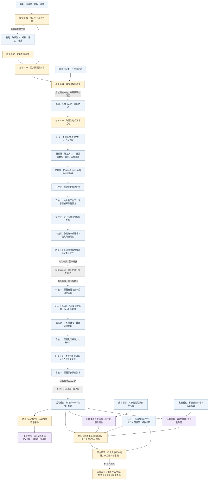
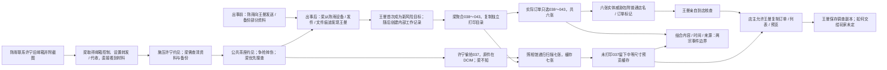
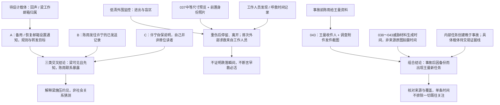

# 《寻人启事》信息依赖设计图

> 开发设计资料，玩家不可见。唯一剧情事实来源仍为 [story-bible.md](story-bible.md)。本文将已确定事实映射到信息出现、复用和证明依赖；不创建页面、素材、游戏事实 ID、解锁条件或谜题代码。

## 1. 范围与标记

- A～D 对应现有 phase-01，已有 `F01`～`F10`、`C01`～`C05`、`R01`～`R05` 的含义不变。具体访问方式见 [phase-01-reachability.md](phase-01-reachability.md)。
- E～K 为已确定 canon 的后续信息设计，**尚未实现**。本轮五条访问 / 证据路径已锁定，标为“已设计”；其余“待设计”不代表已锁定页面、权限或互动谜题。创建者、持有人与取得条件见 [evidence-artifacts.md](evidence-artifacts.md)。
- `A-01` 等 ID 只用于本文追踪信息依赖，不是新增 Case evidence / relation / puzzle ID。
- “玩家首次理解”描述当时证据允许得出的最低限度理解，不提前展示全知剧情。完整因果仍须由可追溯证据支持。
- 日期以相对先后为准；代码现有城市、日期、年份、年龄是 provisional 数据，不在本文确认为最终设定。
- 普通背景新闻、闲聊、日常博客不因气氛或人物出现就自动成为关键线索。只把有复用、证明、关联或重新解释用途的信息列入下表。

## 2. A～K 信息表

### A. 刘佳链（已实现）

| ID | 信息 | 首次出现位置 | 玩家首次理解 | 后续用途 | 解锁/证明什么 | 后期是否重新解释 |
| --- | --- | --- | --- | --- | --- | --- |
| A-01 | 寻人帖创建时间 F01 | `forum_liujia_missing`，帖子时间详情 | 一篇普通寻人启事的发布时间 | 与照片和后来的失联报道对照 | R01 的时间起点 | 是，普通求助后来属于提前寻人模式；单帖不证明动机 |
| A-02 | 同日稍后刘佳仍在校园 F02 | `summer_album`，既有访问问题、原图与拍摄属性比对 | 寻人对象在发帖后仍正常出现 | 核对照片人物与时间；支持 R01 | 公开求助时间与真实活动不一致 | 是，网友善意目击也可能暴露目标位置；具体委托人不补写 |
| A-03 | 后来公开确认的失联起点 F03 | `news_liujia_missing`，新闻正文 | 一则后来发生的失联报道 | 与 A-01、A-02 对照 | R01 → C01“刘佳寻人帖早于真实失联” | 是，报道为早期帖子提供另一个时间基准 |
| A-04 | 发帖当天已有网页缓存 F04 | `cache_liujia_notice`，历史抓取信息 | 旧帖当时已被抓取 | 支持对发布时间的复核 | 辅助确认历史版本存在；不替代 R01 规定的三项输入 | 是，不能仅把异常解释为后来改写的页面；也不单独证明犯罪 |

### B. 赵妍链（已实现）

| ID | 信息 | 首次出现位置 | 玩家首次理解 | 后续用途 | 解锁/证明什么 | 后期是否重新解释 |
| --- | --- | --- | --- | --- | --- | --- |
| B-01 | 赵妍转载寻人帖时间 F05 | `forum_zhaoyan_missing`，回声历史资料 | 较早的一份普通寻人信息 | 对照本人博客与失联报道 | R02 的时间起点 | 是，另一宗同模式事件 |
| B-02 | 赵妍旧邮箱与用户名索引 | 同页附件保留的旧邮箱 → 南城搜索 → `blog_zhao_home` | 一条身份线索可以找到已不在普通导航中的旧博客 | 进入本人公开日志、找到既有访问答案及私密日志 | 建立身份与博客的访问路径；不是自动得到 F06 | 是，旧邮箱作为数字身份入口，但不等于许宁被梁控制的邮箱 |
| B-03 | 寻人帖之后本人仍更新博客 F06 | `blog_zhaoyan`，既有访问问题及发布时间详情 | 寻人之后仍有本人日常活动 | 与 B-01、B-04 对照 | R02 的本人活动时间 | 是，与后来失联基准形成第二例异常 |
| B-04 | 后来公开确认的失联起点 F07 | `news_zhaoyan_missing`，新闻正文 | 后来的未到岗与失联报道 | R02，再与刘佳结论对照 | R02 → C02；C01 + C02 经 R03 → C03“至少两起提前寻人” | 是，两例重复支持模式；不直接证明全部客户或业务规模 |

### C. 回声寻人网规则链（已实现；人物照片待设计）

| ID | 信息 | 首次出现位置 | 玩家首次理解 | 后续用途 | 解锁/证明什么 | 后期是否重新解释 |
| --- | --- | --- | --- | --- | --- | --- |
| C-01 | 正常公益站、来源与公开规则 F08 | 刘佳来源 → `echo_unavailable` → `echo_home`；`echo_submission_rules` 正文 | 网站帮助家属寻人，规则要求先确认无法正常联系 | 与 C03 对照，保留真实公益业务背景 | R04 → C04“异常帖子不符合网站公开规则” | 是，同一工具既可帮人也可暴露主动躲藏者；不能把全部公益业务抹成骗局 |
| C-02 | 梁志诚的创办人身份与普通人物照片 | **已锁定位置、待设计素材**：回声“关于我们”页面；当前尚无人物照片 | 普通网站创办人介绍，无反派提示 | 037恢复后做人脸比对 | 给后期现场人物识别提供先前来源 | **是，关键视觉复用**；不得在初次出现时提示其证据用途 |

### D. 陈雨提前寻人链（核心已实现；威胁与校园照片待设计）

| ID | 信息 | 首次出现位置 | 玩家首次理解 | 后续用途 | 解锁/证明什么 | 后期是否重新解释 |
| --- | --- | --- | --- | --- | --- | --- |
| D-01 | 陈雨寻人帖时间 F09 | `echo_chenyu_notice`，帖子时间详情 | 网站把陈雨列为寻人对象 | 与同日真实 BBS 活动对照 | R05 的时间起点 | 是，同一模式延伸到正在调查的人 |
| D-02 | 同日寻人帖之后本人仍在论坛活动 F10 | `bbs_moderation_log_chenyu`，结构化日志行 | 陈雨当时仍能正常使用论坛 | 与 D-01 对照；引向她的身份与调查 | R05 → C05“陈雨被发布为寻人对象时仍正常活动” | 是，但 C05 单独不证明她已查出全部业务、后来的事故或死亡责任 |
| D-03 | 陈雨查看异常旧帖、收到自己的寻人帖及六张生活照片后尝试自保 | **待设计**：其已有调查资料与通信等可核验载体 | 对方知道她在哪里、也知道她在查什么 | 理解备份、求助与约见动机 | 陈雨应对威胁的合理性；至少一张须体现调查行为 | 是，属于陈雨自己的威胁组，**不能与王曼038～043合并** |
| D-04 | 陈雨白色外套、红色钥匙圈 | **已锁定内容、载体待设计**：事故前普通校园照片；须在037出现前自然看到 | 一张普通校园照片，不标线索 | 037恢复后与现场衣物、钥匙比对 | 支持现场人物是陈雨，而非仅凭相似模糊人影 | **是，关键视觉复用**；不得因此新造一个先行谜题 |

### E. 陈雨调查异常案例（已定 canon，待设计）

| ID | 信息 | 首次出现位置 | 玩家首次理解 | 后续用途 | 解锁/证明什么 | 后期是否重新解释 |
| --- | --- | --- | --- | --- | --- | --- |
| E-01 | 陈雨作为版主见过刘佳，核对来源并追到回声账号 | **已设计**：BBS用户名 → 个人资料 → 版主身份 / 版务入口 → 旧版务记录 | 她曾整理、合并或保留多条寻人帖，正在核发布时间；资料页不自曝调查结论 | 发现普通工作附件链接 | C05之后自然找到调查资料；不靠正文隐形超链接 | 是，普通版务操作后来成为调查来源；入口尚未实现 |
| E-02 | “旧帖时间核对.xls”约九例；刘佳、赵妍高度确认；许宁“已发邮件，待回复” | **已设计**：旧版务记录的附件地址失效 → 网页存档恢复 | 陈雨已系统关注多个异常，表内核查状态仍有差异 | 用已确认案例复核表格、引出许宁邮件 | 第一次明确系统调查及主动联系许宁；至少含人名、启事时间、后续活动 / 失联线索、核查状态 | 是，工作文件不是答案表；其他未锁定案例不填完，备注不单独证实发件 |
| E-03 | 陈雨发往许宁旧邮箱、附案例截图，主题语义“关于你以前那张寻人启事” | **已设计证据要求**：陈雨已发送记录；玩家取得该记录的具体路径仍待设计 | 邮件确实发出，表格备注有通信对应 | 与设置通知、自保说明组合 | 主动核实旧案与暴露路径的一端，不独证梁阅读 | 是，善意核实反而让梁先看到材料 |
| E-04 | 梁以处理骚扰、旧帖与搜索请求为由取得旧邮箱控制，改安全设置并开自动转发 / 代收 | **已设计三类组合**：许宁备用 / 恢复邮箱的服务商设置通知 + E-03发件记录 + 许宁自保说明；目标工作邮箱归属后续核验 | 能看到与先看到了是不同事实，须核对相对先后和邮箱归属 | 解释梁提前知情、施压许宁约见 | 梁可以看到旧邮箱邮件，陈雨联系因此暴露；最终邮箱地址未锁定 | 是，重新解释E-03；不是单张“神奇截图”或黑客能力，取得各副本的入口仍待设计 |

### F. 许宁旧案（已定 canon，待设计）

| ID | 信息 | 首次出现位置 | 玩家首次理解 | 后续用途 | 解锁/证明什么 | 后期是否重新解释 |
| --- | --- | --- | --- | --- | --- | --- |
| F-01 | 许宁躲避暴力控制的前男友；前男友虚称她异常、与家人失联 | 待设计：九例表格的许宁条目、旧求助及可核验资料 | 寻人对象可能主动不想被找到 | 与正常寻人叙述对照 | 回声工具对主动躲藏者的风险 | 是，表面家属求助不能自动当作真实求助动机 |
| F-02 | 梁定位许宁、交付位置；前男友找到她并实施严重暴力 | 待设计：能串联委托、定位交付与后果的来源 | 得到证据后才能确认定位服务与伤害链 | 解释“特殊寻访”的商业价值及许宁后续调查 | 梁完成这一单；不能写成寻访失败后才发展灰色业务 | 是，证明位置聚合被怎样使用；不能把每单都推成绑架或杀人 |
| F-03 | 许宁报警调查后被梁逐步控制为有限外勤；“最后一次”是谎言 | 待设计：她与梁的关系材料，具体载体待定 | 她受控制、能力有限，并非专业跟踪者 | 解释约见、少量现场照片、打印与037自保 | 许宁答应线下约见和执行外围事务的动机 | 是，037是首次真正背叛，不是任务完成照；不提前锁定其最终结局 |

### G. 陈雨约见、受伤与死亡（已定 canon，待设计）

| ID | 信息 | 首次出现位置 | 玩家首次理解 | 后续用途 | 解锁/证明什么 | 后期是否重新解释 |
| --- | --- | --- | --- | --- | --- | --- |
| G-01 | 陈雨主动联系；许宁受梁施压答应线下谈旧帖，陈雨以为只见许宁 | 待设计：约见通信；不得默认普通对话直接承认梁施压 | 陈雨在核实旧案，不知道梁会来 | 与事后现场证据、控制关系比对 | 赴约动机；梁的介入须另有证据 | 是，原本合理的公共约见后来变成风险 |
| G-02 | 地点为城西老商业楼二层小茶座；梁随后出现 | 约见载体待设计；**已设计**低清商业楼监控提供外围出入时序 | 普通公共场所，并非预设犯罪地点 | 监控人物、空间与037现场对应 | 梁进入并离开的时间范围；例外而非日常跟踪方式 | 是，监控有盲区，不拍实际拉扯 / 跌落 |
| G-03 | 陈雨离开时争抢手机 / 包，梁拉住她或包；失衡摔下半层楼梯 | 待设计：能支持争抢与跌落过程的证据组合；037不足以证明 | 证据不足时只知发生严重摔伤 | 与初始事故报道及后期信息对照 | 关键受伤过程；不擅自改成蓄意推下楼 | 是，最终可补充报道未呈现的争抢因果；证明桥梁尚缺 |
| G-04 | 梁确认陈雨仍活着却优先搜查手机 / 包，阻止求助后与许宁离开 | **已设计组合**：CCTV + 037 + 工作人员发现 / 急救电话时间；具体副本取得方式待设计 | 现场图与外部时序共同显示重伤后停留、离开，首次对外求救由工作人员发起 | 支持没有立即寻求外部救助；区别行为与医学反事实 | 不立即外部求救的证据桥梁已补；生命迹象知情与怎样阻止许宁仍需其他材料 | 是，不凭单图决定法律罪名，不断言早救必活 |
| G-05 | 工作人员发现送医；严重颅脑损伤，两天后死亡；最初普通事故报道 | 待设计：公开事故报道及足以核对后续情况的材料 | “年轻女子楼梯摔伤，抢救无效死亡”的表面事故 | 建立公开结果与调查对象 / 现场的身份、时间联系 | 死亡结果已定；报道不证明争抢过程或梁的行为 | 是，后期补充隐去的现场人物与选择，而不抹去报道中的伤情与结果 |

### H. 037（已定 canon，待设计）

| ID | 信息 | 首次出现位置 | 玩家首次理解 | 后续用途 | 解锁/证明什么 | 后期是否重新解释 |
| --- | --- | --- | --- | --- | --- | --- |
| H-01 | 037原件由许宁在陈雨重伤后、梁翻手机 / 包时偷拍，自保留保险 | 待设计：恢复图像后，再以来源、时间与关系材料核验；**不在此前向玩家揭示** | 初见恢复图时只观察人物、物品、动作 | 与许宁受控制的处境和文件来源对照 | 自保行为与首次真正背叛梁；不是英雄行动或任务确认 | 是，重新解释拍摄动机；不能从单图读出所有心理活动 |
| H-02 | 原件在许宁SD卡的DCIM；梁只复制打印目录，未看DCIM | **已设计来源方向**：王曼经许可复制的订单、必要文件列表与缓存；原路径保留字段需设计 | 文件集合不同于打印选择，同卡不代表同组 | 核对七扫六印与两组材料 | 为什么037留下数字残留；目录差异单独不能证明“没有浏览” | 是，玩家最终证据不要求持有原SD卡，梁未看DCIM与许宁拍摄身份仍需佐证 |
| H-03 | 弱光低分辨率轻微模糊；037恢复为中等尺寸预览，有压缩但可辨白衣、红钥匙圈、包、梁侧脸与动作 | **已设计**：王曼保存的照相馆预览缓存；玩家取得王曼资料的方式未定 | 是选片用预览，不是完整原始RAW或事故过程录像 | 与 C-02 创办人照、D-04 校园照及外围时序比对 | 梁在关键时间身处陈雨重伤现场、处理其设备 / 物品 | **是，回用前置普通照片**；实际素材质量须满足比对，不靠无限增强 |
| H-04 | 037不能证明如何摔倒、不能单独证明故意杀人 | 与 H-03 同时明确证据边界；开发说明不做玩家答案弹窗 | 先确认现场在场与可见行为 | 防止后期推理越过证据能力 | 后续跌落过程、知情不救须多来源支持 | 是，补充证据可以扩展认知，不能提高原图本身的证明范围 |

### I. 王曼成为下一目标（已定 canon，待设计）

| ID | 信息 | 首次出现位置 | 玩家首次理解 | 后续用途 | 解锁/证明什么 | 后期是否重新解释 |
| --- | --- | --- | --- | --- | --- | --- |
| I-01 | 年长校友 / 学姐王曼受信任；陈雨出事前给她发送 / 备份部分材料 | 待设计：陈雨发件 / 备份来源及接收方对应资料；文件内容尚未锁定 | 她是正常求助与资料备份对象，具媒体、信息传播或调查能力 | 与出事后风险目标变化对照 | 材料在事故前已外传；不声称完整调查全部送达 | 是，普通备份关系后来变成梁的风险来源 |
| I-02 | 事故前无正式王曼任务；事故后梁发现发件资料，随后建新工作记录 | **已设计三项组合**：043陈雨已发送截图 + 038～043威胁材料生成时间 + 晚于事故的内部任务创建记录；内部载体在梁交易证据线待设计 | 对象、内容和相对时间吻合，不能把旧来源照片时间当威胁包生成时间 | 连接外传副本与后续风险工作 | 王曼因持有资料在事故后进入视野；不能只凭单个创建时间证明之前毫无关注 | 是，内部记录保管 / 关联范围仍须核验，不新增正式任务代码 |
| I-03 | 038～043打印成实体威胁包，显示身份、现实位置、陈雨交付资料及继续搜集生活信息能力 | **来源分工已设计**，见J链与story-bible编号表；王曼收到实体包 | 不是普通资料整理；她仍主动求助和调查 | 043识别通信泄露、冲印袋追到商家 | 针对性威胁与主动调查动机，不决定最终结局 | 是，实体包既威胁她也留下正常商家来源 |

### J. 038～043（已定 canon，待设计）

| ID | 信息 | 首次出现位置 | 玩家首次理解 | 后续用途 | 解锁/证明什么 | 后期是否重新解释 |
| --- | --- | --- | --- | --- | --- | --- |
| J-01 | 实体六张：038公开主页 / 头像；039公开校园 / 活动；040近期位置公共 / 目击信息；041许宁远距离低质照片；042住处 / 工作区域照片或公共组合；043发件截图 | **已设计分工、尚未制作**：梁聚合材料，许宁送印，实体包送达王曼 | 不是专业尾随者连续偷拍；对方掌握身份与生活范围 | 回溯来源、追冲印袋、对照后续风险记录 | 信息聚合与有限外勤模型及明确威胁用途 | 是，各张细节 / 地址 / 日期仍未锁定 |
| J-02 | 分辨率、压缩、设备及原来源时间不同；威胁材料组装生成晚于目标变化 | **证据要求已设计**：图像、来源与组装 / 导出 / 复制时间；可信属性格式待设计 | 原图拍摄、网页发表、复制和材料生成不是同一时间 | 与043及内部工作记录组合 | 支持多来源与事故后任务，不单凭可变属性断言全部因果 | 是，编号连续不等于时间连续或同机拍摄 |
| J-03 | 梁复制到独立打印目录，许宁提交只打印038～043的订单 | **订单副本路径已设计**：王曼经许可复制；目录字段、复制来源佐证与记录格式待设计，不新定目录名 | 六张属于实际打印选择 | 对照DCIM中的037与扫描缓存 | 准确打印集合；梁复制行为须佐证而非目录推定 | 是，排除“第七张太可怕所以不敢印”的传闻解释 |
| J-04 | 043显示王曼为收件人、陈雨曾发送调查资料 / 附件 | **已设计**：实体包中的陈雨“已发送”截图；范围只含必要通信字段 | 威胁方已查看陈雨通信，她的资料接收关系暴露 | 与发件源资料、生成时间、内部新任务对照 | 交付关系与威胁内容指向，不独证截图者或何时第一次知情 | 是，不展示全部调查答案，也不能把截图内的早期发件时间当截图制作时间 |

### K. 城西照相馆七扫六印反转（已定 canon，待设计）

| ID | 信息 | 首次出现位置 | 玩家首次理解 | 后续用途 | 解锁/证明什么 | 后期是否重新解释 |
| --- | --- | --- | --- | --- | --- | --- |
| K-01 | 普通第三方小店、实体袋订单标记；七导六印经外部讨论误传恐怖第七张 | **已设计**：王曼凭袋上店名 / 编号 / 时间找店，携照片说明威胁用途核查；传闻具体载体待设计 | 商家是正常第三方；传闻不是准确记录 | 以订单核验模糊描述，解释真实数字残留 | 普通标签构成来源路径，不用暗号或同伙关系 | 是，七与六的差异未必源于照片内容 |
| K-02 | 软件递归扫描七文件，实际打印六；选片用中等尺寸预览保留037 | **已设计**：王曼经店主许可复制订单、相关缓存与必要列表，存入调查资料 | 导入与打印集合不同，缓存自动存在 | 核对集合，恢复未打印037 | 未打印仍有可恢复预览，非RAW；复制合法且有动机 | 是，老板并不知第七张意义，不是秘密藏证人 |
| K-03 | 玩家未来从王曼保存的副本恢复037，回用前置照片辨人和物 | **来源已设计**：王曼调查副本 → 预览缓存；**玩家取得王曼资料方式仍待定** | 七张不是一组，重新识别两宗事件 | 联系现场图与已见人物照、校园照及CCTV时序 | **037 = 陈雨事件结尾；038～043 = 王曼事件开端** | **是，正式核心反转**；不靠编号，不远程黑进商家 |

## 3. 现有结论的证明依赖

| 已实现关系 | 输入 | 已实现结论 | 不能直接跳到 |
| --- | --- | --- | --- |
| R01 | F01 + F02 + F03 | C01 刘佳寻人帖早于真实失联 | 委托人身份、失踪具体原因 |
| R02 | F05 + F06 + F07 | C02 赵妍存在相同异常 | 与刘佳同一委托人、全部案情 |
| R03 | C01 + C02 | C03 至少两起提前寻人 | 九例都已核实、全部业务规模 |
| R04 | C03 + F08 | C04 异常帖子不符合公开规则 | 梁所有主观动机或非法交易已获证明 |
| R05 | F09 + F10 | C05 陈雨被列为寻人对象时仍正常活动 | 事故过程、死亡责任、王曼目标变化 |

以上是现有关系，不在本轮追加 E～K 的游戏解锁实现。九例表格只能引用有来源的条目；未锁定部分保留占位。

## 4. 依赖链 Mermaid

### 4.1 开发层总链：发现、隐藏事实与后期重建

实线为信息支撑 / 访问依赖；虚线为后续设计串联或隐藏事件的相对先后，**不等于当前已实现的解锁**。灰色节点是开发者已知的 canon，不能直接向玩家当时透露。037在王曼之前生成，不意味着玩家在进入照相馆前就能看见它，也不意味着037促成王曼被列为目标。

蓝色：玩家可看到的载体信息；“已设计”和“待设计”都尚未实现，前者表示路径 / 证据要求已锁定。黄色：建立的结论；紫色：后期重新解释的旧信息；灰色：隐藏事实或明确待定的交付边。任何结论都不得只因开发文档已写canon就直接解锁。

### 4.2 核心因果校验：王曼风险的真正来源

本图是 canon 因果，不宣称玩家已获得所有对应证据。**没有037 → 王曼风险的因果边**；风险来自备份被梁发现。陈雨死亡与王曼被发现 / 图片打印的精确相对时点，不在未锁定日历上自行补定。

### 4.3 本轮锁定的组合证据

## 5. 五个桥梁已设计：来源与访问闭合

| 桥梁 | 已锁定路径 / 证据组合 | 证明与操作边界 | 实现状态 |
| --- | --- | --- | --- |
| 1 C05 → 陈雨调查资料 | BBS用户名 → 资料 → 版主 / 版务入口 → 旧版务操作 → 失效“旧帖时间核对.xls”地址 → 网页存档恢复；表约九例，许宁已发邮件待回复 | 普通工作附件，不自曝“我调查回声”，不是巨大按钮或完整答案表 | 访问路径已设计，未实现；现有陈雨资料仍为旧矩阵中的孤立页 |
| 2 陈雨联系 → 梁提前知情 | 服务商安全 / 转发通知 + 陈雨实际发件 + 许宁自保说明；目标工作邮箱归属后续核验 | 梁因处理骚扰 / 旧帖 / 搜索请求取得控制；不能通知一张证明全部读取 | 控制方式与三类组合已设计，副本取得 / 流转及归属载体待设计 |
| 3 事故 → 在场停留且未立即外部求助 | 低清CCTV固定外围顺序 + 037重伤现场 + 工作人员发现 / 呼救时间 | CCTV保留盲区，037不拍跌落；组合证明停留后离开、工作人员首次求救，不证明早救必活 | 独立时间证据已设计；具体读取权限、时钟校核与其他主观行为证据待设计 |
| 4 陈雨资料 → 王曼新风险 | 043王曼收件 / 附件截图 + 六张威胁材料生成时间 + 事故后内部任务创建时间 | 任务与材料需同对象可核对；不能将旧活动照片时间改成事故后或只用截图定首次知情 | 证据要求已设计；内部具体载体在梁交易证据线未设计 |
| 5 实体威胁包 → 七扫六印 → 037恢复来源 | 袋上店名 / 普通订单标记 → 王曼亲自到店 → 订单七扫六印 → 店主允许复制订单 / 必要列表 / 中等预览 → 王曼保存副本 → 未来玩家恢复037 | 普通商家、正常许可、自动缓存；无黑客、同伙、秘密藏证；玩家取得王曼资料仍不定 | 从照片到王曼保存副本的链已设计，玩家交付边明确未设计 |

### 5.1 相对时间与载体校核

| 链 | 固定的顺序 / 区分 | 本轮不写死的值 |
| --- | --- | --- |
| 邮箱控制 | 安全 / 转发规则生效在陈雨发件之前；梁知情早于许宁首次看到该邮件 | 实际地址、服务商、年月日、精确分钟 |
| 商业楼外围 | 陈雨离开茶座 → 梁进入楼梯区 → 许宁附近出现 → 梁许宁离开、陈雨未同行 → 工作人员进入 → 工作人员呼叫急救 | 可用 `t_leave_tea`、`t_enter_stairs`、`t_xu_nearby`、`t_departure`、`t_staff_discovery`、`t_first_external_call` 表示，均为设计变量而非代码字段 |
| 037与事故 | 037拍摄在重伤之后、梁处理设备 / 物品期间、二人离开之前；监控本身不提供跌落瞬间 | 不发明照片精确EXIF值；以人物、衣着、空间与外围时间范围对照 |
| 王曼任务 | 陈雨向王曼发送资料早于事故；梁事故后发现备份并创建工作记录、制作六张威胁材料 | 事故后任务创建、材料生成、送印的相对时间；不锁定与“两天后死亡”的精确日历位置 |
| 图像属性 | 原图拍摄 / 网页发布 ≠ 截图制作 / 材料生成 ≠ 导出 / 复制 ≠ 内部任务创建 | 最终具体数值与可靠记录格式；不把编号、文件属性当唯一时钟 |

监控、037、呼救记录须指向同一事件并校核时钟与覆盖范围；不是“没有画面拍到求救”就能断言没有求救。内部工作记录须能关联同一王曼任务与043内容，不能用一个可变创建时间排除任何此前关注。

### 5.2 保留的设计空白

- **玩家取得王曼调查资料的方式 / 交付者 / 权限**：刻意保留未定，本轮只锁定她保存照相馆副本。不能在Mermaid或载体表中偷填成某人转交全部材料。
- **邮箱三类副本的取得与流转**：恢复 / 备用邮箱通知、陈雨发件记录、自保说明如何成为玩家可读资料仍需设计；许宁自保说明以后可由王曼资料承载，但由谁交给她尚未锁定。目标工作邮箱归属的具体证据留待后续线。
- **商业楼资料取得与完整因果**：监控 / 工作人员记录的保管与读取权限未定；实际争抢跌落、梁知道生命迹象、阻止许宁求助的具体证明不能交给CCTV / 037代办。
- **许宁旧案定位交易**：委托、位置交付与前男友暴力之间的可核验载体仍需设计，不能因旧邮箱链已闭合就宣称旧案全获证明。
- **前置与文件细节**：校园照自然发现路径、创办人照片素材、中等预览实际可识别质量、缓存与必要列表保留的原路径字段、九例剩余条目，以及各张图的具体构图 / 原来源尚待设计。
- **两宗事件还原与内部载体**：原件拍摄者 / 梁未浏览DCIM的佐证、威胁材料生成时间的可靠载体、内部任务记录范围与真实性仍需落地；不能凭编号与单条创建时间直接推完整因果。

以上为更细的载体 / 权限 / 证明边界或明确保留的下一阶段桥梁，不否定本轮已锁定的五条路径。后续仍优先短搜索、来源回溯、日期比对、图片细节、缓存恢复与证据组合，不改成长篇推理输入。

## 6. 继续保留的待定项

王曼最终结局、许宁最终结局、梁最终法律结局、最终游戏结局、特殊寻访全部交易规模、最终城市名、精确年月日与角色年龄均未锁定；**王曼调查资料最终如何到玩家手里也未锁定**。038～043来源类别分工、实体用途、商家复制链和中等预览形态已锁定，具体素材与余下证据取得方式尚未实现。本轮不新增任何玩家页面或谜题。
