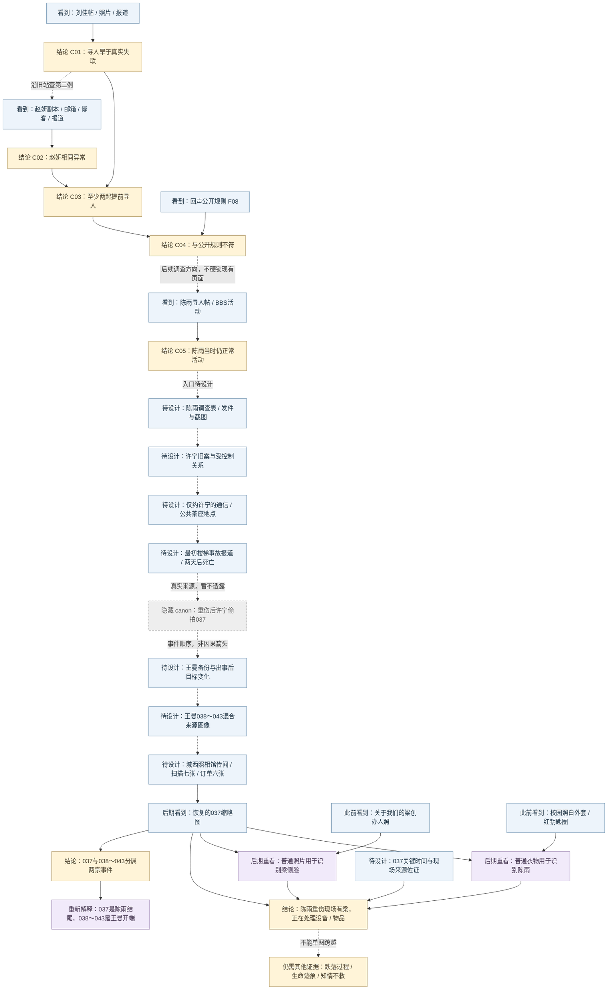
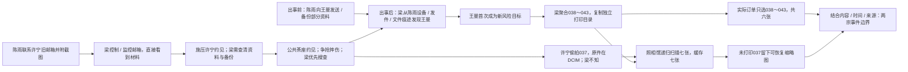

# 《寻人启事》信息依赖设计图

> 开发设计资料，玩家不可见。唯一剧情事实来源仍为 [story-bible.md](story-bible.md)。本文将已确定事实映射到信息出现、复用和证明依赖；不创建页面、素材、游戏事实 ID、解锁条件或谜题代码。

## 1. 范围与标记

- A～D 对应现有 phase-01，已有 `F01`～`F10`、`C01`～`C05`、`R01`～`R05` 的含义不变。具体访问方式见 [phase-01-reachability.md](phase-01-reachability.md)。
- E～K 为已确定 canon 的后续信息设计，**尚未实现**。表格中的“待设计”只说明适合承载该信息的媒介，不代表已经锁定文件名、页面地址、访问权限、取得方式或互动谜题。
- `A-01` 等 ID 只用于本文追踪信息依赖，不是新增 Case evidence / relation / puzzle ID。
- “玩家首次理解”描述当时证据允许得出的最低限度理解，不提前展示全知剧情。完整因果仍须由可追溯证据支持。
- 日期以相对先后为准；代码现有城市、日期、年份、年龄是 provisional 数据，不在本文确认为最终设定。
- 普通背景新闻、闲聊、日常博客不因气氛或人物出现就自动成为关键线索。只把有复用、证明、关联或重新解释用途的信息列入下表。

## 2. A～K 信息表

### A. 刘佳链（已实现）

| ID | 信息 | 首次出现位置 | 玩家首次理解 | 后续用途 | 解锁/证明什么 | 后期是否重新解释 |
| --- | --- | --- | --- | --- | --- | --- |
| A-01 | 寻人帖创建时间 F01 | `forum_liujia_missing`，帖子时间详情 | 一篇普通寻人启事的发布时间 | 与照片和后来的失联报道对照 | R01 的时间起点 | 是，普通求助后来属于提前寻人模式；单帖不证明动机 |
| A-02 | 同日稍后刘佳仍在校园 F02 | `summer_album`，既有访问问题、原图与拍摄属性比对 | 寻人对象在发帖后仍正常出现 | 核对照片人物与时间；支持 R01 | 公开求助时间与真实活动不一致 | 是，网友善意目击也可能暴露目标位置；具体委托人不补写 |
| A-03 | 后来公开确认的失联起点 F03 | `news_liujia_missing`，新闻正文 | 一则后来发生的失联报道 | 与 A-01、A-02 对照 | R01 → C01“刘佳寻人帖早于真实失联” | 是，报道为早期帖子提供另一个时间基准 |
| A-04 | 发帖当天已有网页缓存 F04 | `cache_liujia_notice`，历史抓取信息 | 旧帖当时已被抓取 | 支持对发布时间的复核 | 辅助确认历史版本存在；不替代 R01 规定的三项输入 | 是，不能仅把异常解释为后来改写的页面；也不单独证明犯罪 |

### B. 赵妍链（已实现）

| ID | 信息 | 首次出现位置 | 玩家首次理解 | 后续用途 | 解锁/证明什么 | 后期是否重新解释 |
| --- | --- | --- | --- | --- | --- | --- |
| B-01 | 赵妍转载寻人帖时间 F05 | `forum_zhaoyan_missing`，回声历史资料 | 较早的一份普通寻人信息 | 对照本人博客与失联报道 | R02 的时间起点 | 是，另一宗同模式事件 |
| B-02 | 赵妍旧邮箱与用户名索引 | 同页附件保留的旧邮箱 → 南城搜索 → `blog_zhao_home` | 一条身份线索可以找到已不在普通导航中的旧博客 | 进入本人公开日志、找到既有访问答案及私密日志 | 建立身份与博客的访问路径；不是自动得到 F06 | 是，旧邮箱作为数字身份入口，但不等于许宁被梁控制的邮箱 |
| B-03 | 寻人帖之后本人仍更新博客 F06 | `blog_zhaoyan`，既有访问问题及发布时间详情 | 寻人之后仍有本人日常活动 | 与 B-01、B-04 对照 | R02 的本人活动时间 | 是，与后来失联基准形成第二例异常 |
| B-04 | 后来公开确认的失联起点 F07 | `news_zhaoyan_missing`，新闻正文 | 后来的未到岗与失联报道 | R02，再与刘佳结论对照 | R02 → C02；C01 + C02 经 R03 → C03“至少两起提前寻人” | 是，两例重复支持模式；不直接证明全部客户或业务规模 |

### C. 回声寻人网规则链（已实现；人物照片待设计）

| ID | 信息 | 首次出现位置 | 玩家首次理解 | 后续用途 | 解锁/证明什么 | 后期是否重新解释 |
| --- | --- | --- | --- | --- | --- | --- |
| C-01 | 正常公益站、来源与公开规则 F08 | 刘佳来源 → `echo_unavailable` → `echo_home`；`echo_submission_rules` 正文 | 网站帮助家属寻人，规则要求先确认无法正常联系 | 与 C03 对照，保留真实公益业务背景 | R04 → C04“异常帖子不符合网站公开规则” | 是，同一工具既可帮人也可暴露主动躲藏者；不能把全部公益业务抹成骗局 |
| C-02 | 梁志诚的创办人身份与普通人物照片 | **已锁定位置、待设计素材**：回声“关于我们”页面；当前尚无人物照片 | 普通网站创办人介绍，无反派提示 | 037恢复后做人脸比对 | 给后期现场人物识别提供先前来源 | **是，关键视觉复用**；不得在初次出现时提示其证据用途 |

### D. 陈雨提前寻人链（核心已实现；威胁与校园照片待设计）

| ID | 信息 | 首次出现位置 | 玩家首次理解 | 后续用途 | 解锁/证明什么 | 后期是否重新解释 |
| --- | --- | --- | --- | --- | --- | --- |
| D-01 | 陈雨寻人帖时间 F09 | `echo_chenyu_notice`，帖子时间详情 | 网站把陈雨列为寻人对象 | 与同日真实 BBS 活动对照 | R05 的时间起点 | 是，同一模式延伸到正在调查的人 |
| D-02 | 同日寻人帖之后本人仍在论坛活动 F10 | `bbs_moderation_log_chenyu`，结构化日志行 | 陈雨当时仍能正常使用论坛 | 与 D-01 对照；引向她的身份与调查 | R05 → C05“陈雨被发布为寻人对象时仍正常活动” | 是，但 C05 单独不证明她已查出全部业务、后来的事故或死亡责任 |
| D-03 | 陈雨查看异常旧帖、收到自己的寻人帖及六张生活照片后尝试自保 | **待设计**：其已有调查资料与通信等可核验载体 | 对方知道她在哪里、也知道她在查什么 | 理解备份、求助与约见动机 | 陈雨应对威胁的合理性；至少一张须体现调查行为 | 是，属于陈雨自己的威胁组，**不能与王曼038～043合并** |
| D-04 | 陈雨白色外套、红色钥匙圈 | **已锁定内容、载体待设计**：事故前普通校园照片；须在037出现前自然看到 | 一张普通校园照片，不标线索 | 037恢复后与现场衣物、钥匙比对 | 支持现场人物是陈雨，而非仅凭相似模糊人影 | **是，关键视觉复用**；不得因此新造一个先行谜题 |

### E. 陈雨调查异常案例（已定 canon，待设计）

| ID | 信息 | 首次出现位置 | 玩家首次理解 | 后续用途 | 解锁/证明什么 | 后期是否重新解释 |
| --- | --- | --- | --- | --- | --- | --- |
| E-01 | 陈雨作为版主见过刘佳，核对来源并追到回声账号 | 待设计：陈雨调查材料；当前管理日志只能证明已有活动 | 陈雨不是随机被卷入，她发现了相同异常 | 从 C05 通向陈雨的调查路径 | 把调查者身份、来源查询与旧帖联系起来 | 是，解释她为何接近网站秘密；具体新材料入口待定 |
| E-02 | 约九例提前寻人表格，包含许宁 | 待设计：调查表格及可追溯原来源；不填未锁定的其他案例 | 玩家发现有人已进行系统核对 | 与已确认的刘佳、赵妍模式比对，定位许宁旧案 | 调查范围与许宁案例之间的桥梁 | 是，表格也成为梁担忧资料外传的对象；不默认其中所有结果等于已证明事实 |
| E-03 | 陈雨为核实旧案，给许宁旧邮箱发邮件并附案例截图 | 待设计：发送记录与对应附件 | 她主动找旧案当事人核实 | 通向许宁回应、约见；后期验证梁看到调查内容 | 陈雨接近秘密的具体通信路径 | 是，善意核实反而让梁直接看到材料 |
| E-04 | 许宁旧邮箱已被梁控制或监控，梁直接看到调查材料 | 待设计：足以验证控制 / 监控与读取的交叉证据；不能只凭邮件已发送 | 在取得证明后才理解信息泄露 | 解释梁介入、施压许宁约见与不确定的备份风险 | 梁知道陈雨发现规律；不是凭社会关系猜测 | 是，重新解释 E-03；控制与监控的具体方式仍未锁定，不能发明万能黑客 |

### F. 许宁旧案（已定 canon，待设计）

| ID | 信息 | 首次出现位置 | 玩家首次理解 | 后续用途 | 解锁/证明什么 | 后期是否重新解释 |
| --- | --- | --- | --- | --- | --- | --- |
| F-01 | 许宁躲避暴力控制的前男友；前男友虚称她异常、与家人失联 | 待设计：九例表格的许宁条目、旧求助及可核验资料 | 寻人对象可能主动不想被找到 | 与正常寻人叙述对照 | 回声工具对主动躲藏者的风险 | 是，表面家属求助不能自动当作真实求助动机 |
| F-02 | 梁定位许宁、交付位置；前男友找到她并实施严重暴力 | 待设计：能串联委托、定位交付与后果的来源 | 得到证据后才能确认定位服务与伤害链 | 解释“特殊寻访”的商业价值及许宁后续调查 | 梁完成这一单；不能写成寻访失败后才发展灰色业务 | 是，证明位置聚合被怎样使用；不能把每单都推成绑架或杀人 |
| F-03 | 许宁报警调查后被梁逐步控制为有限外勤；“最后一次”是谎言 | 待设计：她与梁的关系材料，具体载体待定 | 她受控制、能力有限，并非专业跟踪者 | 解释约见、少量现场照片、打印与037自保 | 许宁答应线下约见和执行外围事务的动机 | 是，037是首次真正背叛，不是任务完成照；不提前锁定其最终结局 |

### G. 陈雨约见、受伤与死亡（已定 canon，待设计）

| ID | 信息 | 首次出现位置 | 玩家首次理解 | 后续用途 | 解锁/证明什么 | 后期是否重新解释 |
| --- | --- | --- | --- | --- | --- | --- |
| G-01 | 陈雨主动联系；许宁受梁施压答应线下谈旧帖，陈雨以为只见许宁 | 待设计：约见通信；不得默认普通对话直接承认梁施压 | 陈雨在核实旧案，不知道梁会来 | 与事后现场证据、控制关系比对 | 赴约动机；梁的介入须另有证据 | 是，原本合理的公共约见后来变成风险 |
| G-02 | 地点为城西老商业楼二层小茶座；梁随后出现 | 待设计：约见位置与可核验现场信息，具体取得方式待定 | 普通公共场所，并非预设犯罪地点 | 支持事故地点与037现场空间对应 | 梁因秘密与备份风险亲自介入；例外而非日常跟踪方式 | 是，现场还原不等于预谋杀人 |
| G-03 | 陈雨离开时争抢手机 / 包，梁拉住她或包；失衡摔下半层楼梯 | 待设计：能支持争抢与跌落过程的证据组合；037不足以证明 | 证据不足时只知发生严重摔伤 | 与初始事故报道及后期信息对照 | 关键受伤过程；不擅自改成蓄意推下楼 | 是，最终可补充报道未呈现的争抢因果；证明桥梁尚缺 |
| G-04 | 梁确认陈雨仍活着却优先搜查手机 / 包，阻止求助后与许宁离开 | 待设计：037可支持处理物品，生命迹象、求助受阻与离开须其他来源 | 图像只能显示可见行为，不能自动知道全部意图 | 区分主动不救与预谋杀人 | 最关键主动选择；立即求救是否必定救活仍不确定 | 是，不凭单图决定法律罪名或救活的反事实 |
| G-05 | 工作人员发现送医；严重颅脑损伤，两天后死亡；最初普通事故报道 | 待设计：公开事故报道及足以核对后续情况的材料 | “年轻女子楼梯摔伤，抢救无效死亡”的表面事故 | 建立公开结果与调查对象 / 现场的身份、时间联系 | 死亡结果已定；报道不证明争抢过程或梁的行为 | 是，后期补充隐去的现场人物与选择，而不抹去报道中的伤情与结果 |

### H. 037（已定 canon，待设计）

| ID | 信息 | 首次出现位置 | 玩家首次理解 | 后续用途 | 解锁/证明什么 | 后期是否重新解释 |
| --- | --- | --- | --- | --- | --- | --- |
| H-01 | 037原件由许宁在陈雨重伤后、梁翻手机 / 包时偷拍，自保留保险 | 待设计：恢复图像后，再以来源、时间与关系材料核验；**不在此前向玩家揭示** | 初见恢复图时只观察人物、物品、动作 | 与许宁受控制的处境和文件来源对照 | 自保行为与首次真正背叛梁；不是英雄行动或任务确认 | 是，重新解释拍摄动机；不能从单图读出所有心理活动 |
| H-02 | 原件在许宁SD卡的DCIM；梁只复制打印目录，未看DCIM | 待设计：SD目录 / 原路径与复制痕迹等；具体可取得来源待定 | 文件来自不同目录，未必属于同一组 | 与七张扫描、六张订单对照 | 为什么同卡且梁未发现；目录差异单独不能证明“没有浏览” | 是，同一存储介质不等于同一拍摄任务 |
| H-03 | 弱光低分辨率轻微运动模糊；仍可识别白外套、红钥匙圈、倒地者、敞开包 / 散落物、梁持手机 / 翻物和侧脸 | 待设计：照相馆缓存恢复得到的037缩略图；恢复后须达到识别要求 | 一张受限画质的现场图，不是事故过程录像 | 与 C-02 创办人照、D-04 校园照比对 | 梁在关键时间身处现场，陈雨重伤时处理其设备 / 物品 | **是，回用前置普通照片**；具体缩略图清晰度与关联时间的佐证需设计 |
| H-04 | 037不能证明如何摔倒、不能单独证明故意杀人 | 与 H-03 同时明确证据边界；开发说明不做玩家答案弹窗 | 先确认现场在场与可见行为 | 防止后期推理越过证据能力 | 后续跌落过程、知情不救须多来源支持 | 是，补充证据可以扩展认知，不能提高原图本身的证明范围 |

### I. 王曼成为下一目标（已定 canon，待设计）

| ID | 信息 | 首次出现位置 | 玩家首次理解 | 后续用途 | 解锁/证明什么 | 后期是否重新解释 |
| --- | --- | --- | --- | --- | --- | --- |
| I-01 | 年长校友 / 学姐王曼受信任；陈雨出事前给她发送 / 备份部分材料 | 待设计：陈雨发件 / 备份来源及接收方对应资料；文件内容尚未锁定 | 她是正常求助与资料备份对象，具媒体、信息传播或调查能力 | 与出事后风险目标变化对照 | 材料在事故前已外传；不声称完整调查全部送达 | 是，普通备份关系后来变成梁的风险来源 |
| I-02 | 梁在陈雨出事后才通过其设备 / 发件 / 文件痕迹发现王曼可能持有副本 | 待设计：有时间顺序的发现与目标变化证据，单有发件记录不够 | 获得证据后才确认她为何成为目标 | 连接038～043的对象、内容与威胁目的 | 王曼不是梁提前安排的下一目标 | 是，陈雨材料外传是风险产生点；不能凭文件编号证明梁何时知情 |
| I-03 | 威胁表明对方知她持有材料、生活范围、正在做的事及陈雨已出事 | 待设计：038～043与其他威胁内容的组合，具体分配未定 | 不是普通偷拍；她仍会备份、求助或咨询 | 解释六张为什么被制作与打印 | 威胁针对性，不决定王曼是否屈服或最终结局 | 是，需以实际内容建立指向，不能凭设计者全知解释 |

### J. 038～043（已定 canon，待设计）

| ID | 信息 | 首次出现位置 | 玩家首次理解 | 后续用途 | 解锁/证明什么 | 后期是否重新解释 |
| --- | --- | --- | --- | --- | --- | --- |
| J-01 | 六张针对王曼的图像，来自公开网页、公开活动、网络保存 / 目击信息和少量许宁远距离拍摄，可有截图 | 待设计：图像与能回溯的原来源；每张内容不在本轮分配 | 不是同一专业尾随者连续拍下的一组 | 搜索原页面、属性比对、判断来源差异 | 信息聚合与有限外勤的能力模型 | 是，混合来源解释画质差异，不能仅凭画质认定具体拍摄者 |
| J-02 | 分辨率、压缩痕迹、设备与时间来源不同 | 待设计：图像及可靠属性 / 来源信息；网页时间不等于拍摄时间 | 时间与载体不能直接混为一列 | 区分原图、网络保存图与可选截图 | 支持多来源组合，不自动证明委托或复制者身份 | 是，编号连续不等于时间连续、同机连续拍摄 |
| J-03 | 梁复制到独立打印目录，许宁提交只打印038～043的订单 | 待设计：目录信息、复制来源佐证、订单 / 日志；不新定目录名 | 六张属于实际打印选择 | 对照DCIM中的037与扫描缓存 | 准确打印集合；梁复制行为须佐证而非目录推定 | 是，排除“第七张太可怕所以不敢印”的传闻解释 |

### K. 城西照相馆七扫六印反转（已定 canon，待设计）

| ID | 信息 | 首次出现位置 | 玩家首次理解 | 后续用途 | 解锁/证明什么 | 后期是否重新解释 |
| --- | --- | --- | --- | --- | --- | --- |
| K-01 | 普通第三方小店、店员模糊记忆、网上“七张中一张太可怕没打印”的传闻 | 待设计：普通店铺相关资料与传闻载体；首次找到商家的路径待定 | 传闻提供待核验问题，不当作事实 | 找正式扫描 / 订单依据，区分记忆与记录 | 推动核实七与六的差异；不把商家写成同伙 | 是，传闻的恐怖解释后来被正常软件行为取代 |
| K-02 | 旧软件递归扫描整卡七张，自动生成缩略图缓存；订单仅打印六张 | 待设计：扫描记录、订单与缓存，具体软件、记录格式和取得方式待定 | 扫描集合不同于打印集合 | 配对文件集合、目录与缓存 | 未打印037仍可留下可恢复缩略图 | 是，数字残留来自自动过程，非人为投放证据 |
| K-03 | 037未打印且不属于王曼六张；037恢复后可回用旧照片辨认人和物 | 待设计：缓存中的037及前置照片，恢复机制另行设计 | 七张不是一组；恢复图带来新的身份关联 | 建立陈雨事件现场与梁在场的结论 | **037 = 陈雨事件结尾；038～043 = 王曼事件开端** | **是，正式核心反转**；两宗事件边界不能由编号独自证明 |

## 3. 现有结论的证明依赖

| 已实现关系 | 输入 | 已实现结论 | 不能直接跳到 |
| --- | --- | --- | --- |
| R01 | F01 + F02 + F03 | C01 刘佳寻人帖早于真实失联 | 委托人身份、失踪具体原因 |
| R02 | F05 + F06 + F07 | C02 赵妍存在相同异常 | 与刘佳同一委托人、全部案情 |
| R03 | C01 + C02 | C03 至少两起提前寻人 | 九例都已核实、全部业务规模 |
| R04 | C03 + F08 | C04 异常帖子不符合公开规则 | 梁所有主观动机或非法交易已获证明 |
| R05 | F09 + F10 | C05 陈雨被列为寻人对象时仍正常活动 | 事故过程、死亡责任、王曼目标变化 |

以上是现有关系，不在本轮追加 E～K 的游戏解锁实现。九例表格只能引用有来源的条目；未锁定部分保留占位。

## 4. 依赖链 Mermaid

### 4.1 开发层总链：发现、隐藏事实与后期重建

实线为信息支撑 / 访问依赖；虚线为后续设计串联或隐藏事件的相对先后，**不等于当前已实现的解锁**。灰色节点是开发者已知的 canon，不能直接向玩家当时透露。037在王曼之前生成，不意味着玩家在进入照相馆前就能看见它，也不意味着037促成王曼被列为目标。

蓝色：玩家可看到的载体信息（标“待设计”的目前不可见）；黄色：建立的结论；紫色：后期重新解释的旧信息；灰色：开发者已知、须由后期来源重建的隐藏事实。任何结论都不得只因开发文档已写 canon 就直接解锁。

### 4.2 核心因果校验：王曼风险的真正来源

本图是 canon 因果，不宣称玩家已获得所有对应证据。**没有037 → 王曼风险的因果边**；风险来自备份被梁发现。陈雨死亡与王曼被发现 / 图片打印的精确相对时点，不在未锁定日历上自行补定。

## 5. 逻辑断点与尚缺桥梁

| 桥梁 | 已确定的两端 | 尚缺的玩家可见证据 / 设计决策 | 禁止用来补空白的捷径 |
| --- | --- | --- | --- |
| 当前 phase-01 → 陈雨调查 | C05；陈雨确实调查九例 | 从已有陈雨页面自然找到表格 / 发件材料的路径、来源与权限；九例未锁定条目保留占位 | 点击普通正文词突然跳到调查资料；直接生成完整九例 |
| 许宁旧案 → 邮箱泄露 → 梁介入 | 定位交付与暴力、邮箱被梁控制 / 监控 | 委托交付、前男友后果、邮箱控制与实际读取分别如何核验；控制还是监控的具体方式 | 已发送邮件就证明梁收到；全能黑客或全知反派 |
| 约见 → 公开事故 → 陈雨身份 | 普通茶座、争抢跌落、送医与两天后死亡 | 约见信息、事故报道与陈雨身份 / 时间 / 地点的交叉证据；对争抢和生命迹象的独立佐证 | 仅用037证明怎样摔倒、梁知道她活着或预谋杀人 |
| 前置照片 → 037识别 | 关于我们梁照片；陈雨校园照白衣红钥匙圈；037可识别要求 | 两张前置照片的自然发现路径；缓存缩略图质量需足以回认脸、衣物、钥匙，关键时间须佐证 | 缩略图无限增强；到了037才临时补进身份照片 |
| 陈雨备份 → 王曼新风险 | 出事前部分资料已外传，梁出事后才发现 | 实际发送 / 接收资料范围、梁发现时间和目标变化的可见证据 | 默认完整资料全部送达；从两人认识就认定梁预先盯上王曼 |
| 王曼 → 六张图像 → 照相馆 | 图像混合来源、第三方小店、现金六张订单 | 每张内容 / 来源的分配；玩家如何自然找到商家与可读取订单、扫描记录、缓存 | 把小店改成同伙；把全部照片归为许宁专业尾随；填入王曼结局 |
| DCIM / 打印目录 → 七扫六印 → 037恢复 | 同卡分目录、递归七扫、订单六印、自动缓存 | 哪份历史记录能保留原路径 / 文件集合；缓存恢复载体、权限与方法；未浏览DCIM与许宁拍摄身份如何佐证 | 文件编号等于拍摄日期；单靠目录证明复制者；传闻等于精确日志 |
| 编号连续 → 两宗事件断点 | 037陈雨事件结尾、038～043王曼事件开端 | 内容身份、可靠相对时间与来源共同支持分组；混合图像保存时间不得当成拍摄时间 | 仅凭037和038编号相邻就得到全部真实时序 |

这些是**证据与访问设计空白**，不是更改已确认因果的理由。后续优先采用阅读、短搜索、来源回溯、时间比对、图片细节与证据组合；不以长篇自由推理输入替代桥梁。

## 6. 继续保留的待定项

王曼最终结局、许宁最终结局、梁最终法律结局、最终游戏结局、特殊寻访全部客户规模、最终城市名、精确年月日与角色年龄均未锁定。037的识别要求和两宗事件边界已锁定，但图片素材参数、每张038～043具体来源、后续载体取得方式与解锁设计仍未实现。本轮不新增任何玩家页面或谜题。
